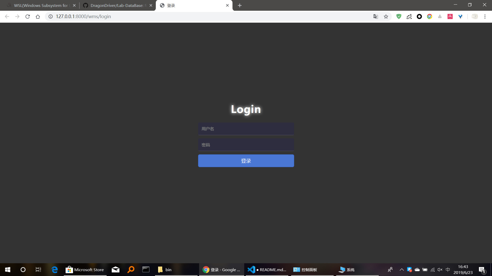
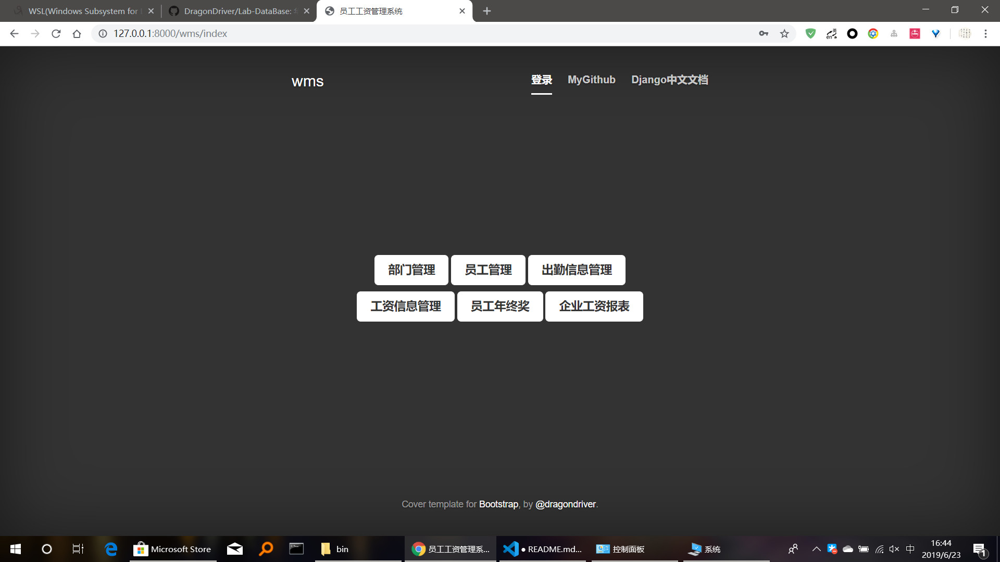
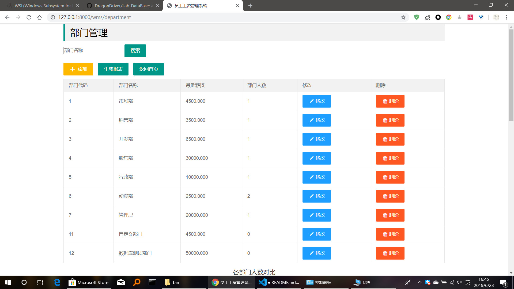
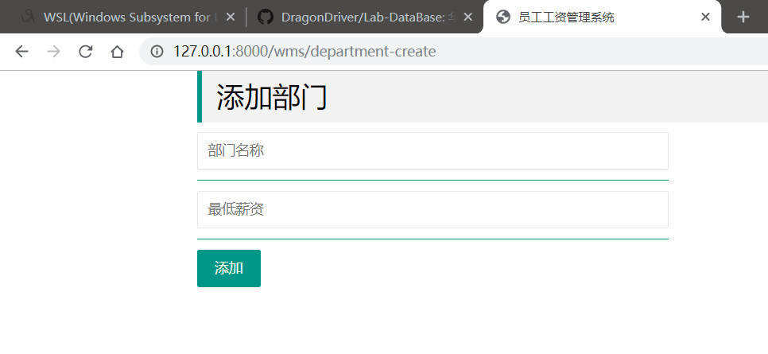
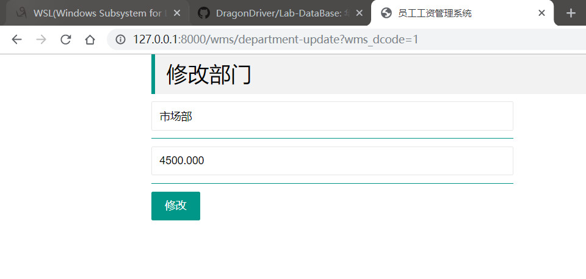
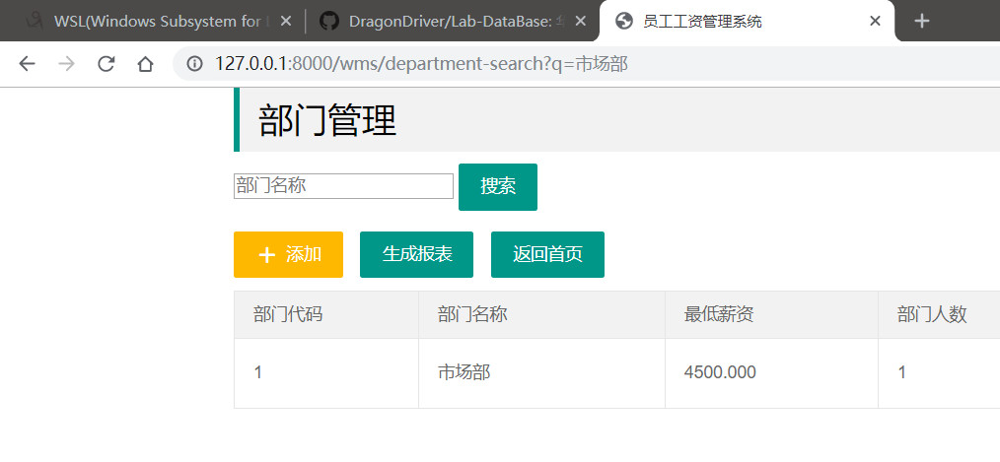
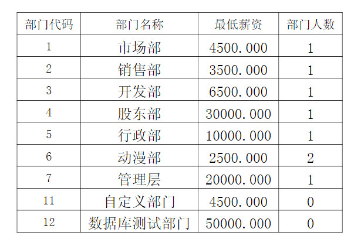
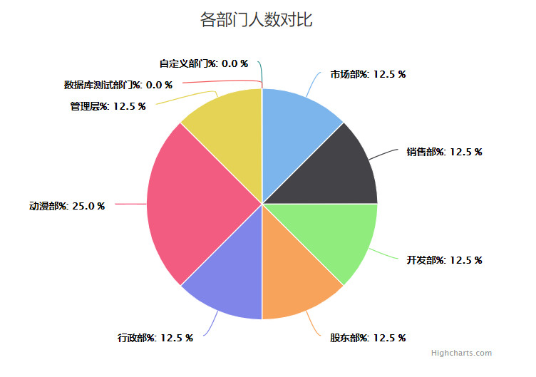
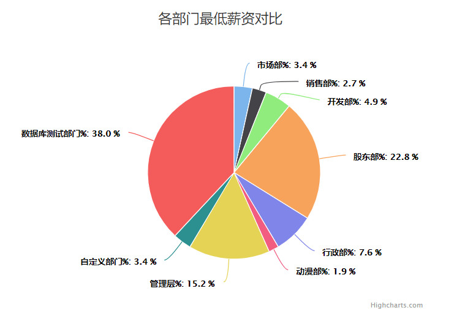

## 如何使用
'''
安装python3.6及以上
安装django，pip install django
安装reportlab，pip install reportlab
安装完成后，在项目根目录执行python manage.py runserver
浏览器输入127.0.0.1:8000即可
'''

## ER图

## 登录

## 主页

## 部门管理主页

## 增加部门

## 修改部门

## 搜索部门

## 部门报表PDF生成

## 特色功能饼状图

